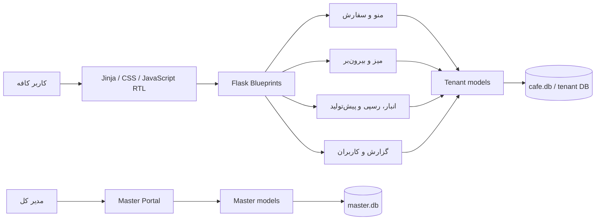

# نقشه جامع پروژه کافه

آخرین بازبینی محلی: ۱۴۰۵/۰۵/۲۲ (2026-08-13)

## در یک نگاه

این پروژه یک سامانه فارسی و راست‌به‌چپ برای **صندوق فروش، سفارش‌گیری، مدیریت میز و بیرون‌بر، منو، انبار، رسپی و قیمت تمام‌شده، گزارش مالی، کاربران و مدیریت چند کافه** است.

- Backend: Python + Flask + SQLAlchemy
- UI: Jinja2 + CSS + JavaScript ساده
- داده فعلی: SQLite؛ پیکربندی اتصال جداگانه برای دیتابیس اصلی و master
- استقرار تعریف‌شده: Gunicorn پشت Nginx
- مدل اجرا: یک پورتال master و دیتابیس مستقل برای هر کافه
- رابط: فارسی، RTL و تاریخ جلالی

## نسخه مرجع نهایی

- مسیر فعال: `C:\Users\saleh\Claude\Projects\cafe`
- منبع کد: `C:\Users\saleh\Projects\cafe_project`
- مخزن مرجع: `salehmohamadkhani/cafe`
- شاخه مرجع: `main`
- commit پایه: `feea449`
- نسبت با نسخه `cafe(FULL)`: commit آن (`54a8d9f`) جد مستقیم نسخه مرجع است؛ قابلیت اجرایی حذف نشده و commitهای بعدی README و License را افزوده‌اند.

این پوشه از کد tracked شاخه `main` ساخته شده است. دیتابیس، محیط مجازی، cache، zip، backup و کپی کامل tenantهای نسخه‌های قدیمی عمداً وارد آن نشده‌اند.

## نقشه معماری



### لایه‌ها و مسئولیت‌ها

| مسیر | مسئولیت |
|---|---|
| `app.py` | application factory، ثبت blueprintها، آماده‌سازی دیتابیس و startup |
| `config.py` | مسیر tenantها، secret نشست و URI دیتابیس اصلی/master |
| `models/models.py` | مدل‌های عملیاتی هر کافه: سفارش، منو، مشتری، میز، انبار، مواد و پیش‌تولید |
| `models/master_models.py` | کافه‌ها، کاربران master، ماژول‌ها، رخدادها، OTP و درخواست ساخت کاربر |
| `routes/` | ورودی‌های HTTP تفکیک‌شده بر اساس حوزه کاری |
| `services/inventory_service.py` | منطق مصرف و موجودی |
| `services/tenant_provisioning.py` | ایجاد tenant و دیتابیس آن |
| `services/master_service.py` | ساخت مدیر مرکزی، catalog ماژول‌ها، ثبت کافه و اعمال دسترسی‌ها |
| `services/sms_service.py` | درگاه‌های SMS/OTP؛ هنوز به جریان ورود اصلی متصل و تست‌شده نیست |
| `templates/` | صفحات Jinja فارسی |
| `static/` | design system، CSS، JavaScript، فونت و لوگو |
| `migrations/` | زیرساخت Alembic و migrationهای موجود |
| `data/inventory_seed.py` | داده اولیه انبار |
| `instance/` | داده runtime محلی؛ در Git نگهداری نمی‌شود |
| `tenants/` | داده و فضای tenantها؛ در Git نگهداری نمی‌شود |

## حوزه‌های پیاده‌سازی‌شده

1. سفارش عادی، سفارش میز، انتقال میز، بیرون‌بر، پرداخت و چاپ فاکتور
2. منو، دسته‌بندی، قیمت، جست‌وجو و اتصال آیتم منو به مواد اولیه
3. مشتری، گزارش سفارش و گزارش مالی
4. مواد اولیه، خرید، مصرف خودکار، چند انبار، انتقال، ضایعات و حداقل موجودی
5. رسپی، قیمت تمام‌شده، آیتم پیش‌تولید، تولید و انتقال پیش‌تولید
6. کاربران با نقش‌های master، admin و cashier
7. پورتال master، ایجاد کافه، فعال/غیرفعال‌سازی و گزارش هر کافه

## مدیریت مرکزی پیاده‌سازی‌شده

- ورود محلی master: `admin / admin` در `/master/login`
- رمز در دیتابیس به‌صورت hash ذخیره می‌شود و ورود دیگر کاربر master را خودکار ایجاد نمی‌کند.
- نام کاربری و رمز bootstrap با `MASTER_USERNAME` و `MASTER_PASSWORD` قابل تعویض است؛ مقدار پیش‌فرض فقط برای اجرای محلی است.
- هر کافه یک رکورد در `master.db`، هفت رکورد وضعیت ماژول و یک دیتابیس عملیاتی مستقل دارد.
- غیرفعال‌سازی کافه و تغییر ماژول‌ها از صفحه «دسترسی‌ها» انجام و در event log مادر ثبت می‌شود.
- همه کافه‌ها از یک codebase مشترک اجرا می‌شوند؛ tenant فقط پوشه داده و دیتابیس مستقل دارد.

سه نمونه محلی:

| کافه | کاربر | نقش | دسترسی شاخص |
|---|---|---|---|
| کافه مدلین | `admin / admin123` | مدیر | همه ماژول‌ها |
| کافه کیوسک | `cashier / cashier123` | صندوق‌دار | فروش، منو، مشتری و گزارش |
| کافه روستری | `inventory / inventory123` | انباردار | انبار، منو، گزارش و کاربران |

## نتیجه بررسی همه نسخه‌های محلی

| مسیر | نقش واقعی | تصمیم |
|---|---|---|
| `Projects\cafe_project` | جدیدترین clone تمیز `main` و کامل‌ترین کد | پایه نسخه نهایی |
| `Projects\cafe(FULL)` | نسخه کامل نسل قبل + دیتابیس‌ها + یک کپی کامل سورس داخل tenant | مرجع داده و تاریخچه، نه پایه کد |
| `Projects\cafe_github` | نسخه قدیمی‌تر GitHub روی `7da7390` | آرشیو تاریخی |
| `Projects\cafe2` | نسخه میانی روی `efc2f21` با چند تغییر محلی | آرشیو تاریخی |
| `Projects\cafe1` | کد قدیمی بدون Git، اما دارای مهم‌ترین دیتابیس واقعی | فقط منبع migration داده |
| `Projects\cafesite\cafe` | snapshot عیب‌یابی با اسکریپت‌های موقت پاک‌سازی/رفع خطا | مرجع عیب‌یابی |
| `Users\saleh\cafe` | هم‌خانواده snapshot عیب‌یابی و دارای تغییرات محلی | مرجع عیب‌یابی |
| `Projects\cafe` | قدیمی‌ترین هسته و پیش‌نویس ناقص BOM | مرجع تاریخی؛ ادغام نشود |

نام `FULL` به معنی بهترین codebase نیست. حجم اضافه آن عمدتاً داده، محیط مجازی و تکثیر سورس است. `cafe_project/main` تمام قابلیت‌های هسته آن را در تاریخچه خود دارد و انتخاب قابل‌ردیابی‌تری است.

## نقشه داده‌ها

- نامزد داده واقعی legacy: `C:\Users\saleh\Projects\cafe1\instance\cafe.db`
- این دیتابیس در ممیزی قبلی سالم بود و شامل ۳۶۱۷ سفارش، ۷۲۶۵ ردیف سفارش، ۲۳۲ آیتم منو و ۱۳۱ ماده اولیه بود.
- مرجع ساختار چندکافه‌ای: دیتابیس‌های `instance` و `tenants` در `cafe(FULL)`.
- schema دیتابیس `cafe1` از کد فعلی عقب‌تر است؛ جایگزینی مستقیم فایل ممنوع است.
- migration باید روی **کپی** اجرا شود و تعداد رکوردهای قبل و بعد تطبیق داده شود.

هیچ داده واقعی به نسخه نهایی کپی نشده است. اجرای محلی، دیتابیس‌های تازه را داخل `instance/` می‌سازد.

## جریان اجرای برنامه

1. `create_app()` تنظیمات و SQLAlchemy را بارگذاری می‌کند.
2. دیتابیس operational و bind مربوط به master آماده می‌شوند.
3. blueprintهای auth، master، tenant، menu، order، dashboard، admin، POS، table و takeaway ثبت می‌شوند.
4. درخواست master با دیتابیس master کار می‌کند؛ درخواست کافه با دیتابیس operational/tenant کار می‌کند.
5. قالب‌های Jinja پاسخ HTML فارسی را تولید می‌کنند و JavaScript تعاملات میز، بیرون‌بر و منو را انجام می‌دهد.

## اجرای محلی

```powershell
py -3.14 -m venv .venv
.\.venv\Scripts\python.exe -m pip install -r requirements_production.txt
.\.venv\Scripts\python.exe -m flask --app app run --host 127.0.0.1 --port 5000 --no-debugger --no-reload
```

آدرس‌ها:

- صفحه اصلی: `http://127.0.0.1:5000/`
- ورود master: `http://127.0.0.1:5000/master/login`
- ورود کافه: `http://127.0.0.1:5000/auth/login`

## مرزهای نسخه فعلی

- startup هنوز `create_all` و چند اصلاح دستی schema را اجرا می‌کند؛ پیش از اتصال به داده واقعی باید به migration نسخه‌دار تبدیل شود.
- تست خودکار end-to-end وجود ندارد.
- OTP/SMS هنوز به جریان ورود اصلی متصل و end-to-end تست نشده است؛ وابستگی HTTP آن در نسخه یکپارچه ثبت شده است.
- پشتیبانی PostgreSQL در README قدیمی ادعا شده، اما مسیر عملی فعلی SQLite است و PostgreSQL باید جداگانه اثبات شود.
- جداسازی فعلی در سطح فایل‌های SQLite انجام می‌شود؛ برای مقیاس production باید connection/session tenant با الگوی رسمی SQLAlchemy و تست هم‌زمانی سخت‌تر شود.
- چند اسکریپت قدیمی deployment و مدیریت سرور هنوز در ریشه وجود دارند؛ پیش از استفاده باید credentialهای قدیمی rotate و خود اسکریپت‌ها بازبینی شوند.

## قانون ادامه توسعه

از این پس فقط این پوشه و شاخه `main` باید منبع تغییرات کد باشند. نسخه‌های قدیمی تا پایان migration داده حذف یا بازنویسی نشوند، اما هیچ فایل کدی از آن‌ها بدون diff، تست و تصمیم مستند به نسخه نهایی منتقل نشود.
