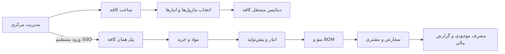

# سامانه یکپارچه مدیریت کافه

پلتفرم چندکافه‌ای فارسی برای مدیریت مرکز فرمان، کاربران، صندوق و سفارش، منو و BOM، مواد اولیه، خرید، چند انبار، پیش‌تولید، بهای تمام‌شده، حسابداری و باشگاه مشتریان.

[](https://www.python.org/)
[](https://flask.palletsprojects.com/)
[](tests/)
[](LICENSE)

این مخزن نسخه یکپارچه و مرجع پروژه است. اطلاعات هر کافه در دیتابیس مستقل نگهداری می‌شود و دیتابیس مادر، کافه‌ها، ماژول‌ها و ساختار دسترسی را کنترل می‌کند.

## راه‌اندازی یک‌کلیکی در ویندوز

اگر کاربر دانش فنی ندارد، همین روش کافی است:

1. از صفحه GitHub گزینه **Code → Download ZIP** را بزنید.
2. ZIP را به‌طور کامل Extract کنید.
3. روی [`INSTALL_AND_RUN.bat`](INSTALL_AND_RUN.bat) دوبار کلیک کنید.
4. در اجرای اول مسیر پوشه پروژه پرسیده می‌شود. اگر فایل BAT داخل همان پوشه است، فقط Enter بزنید.
5. برنامه به‌صورت خودکار Python، محیط مجازی، وابستگی‌ها، برنامه و دیتابیس را بررسی می‌کند.
6. پس از آماده‌شدن سرور، مرورگر روی `http://127.0.0.1:5000` باز می‌شود.
7. پنجره CMD را باز نگه دارید. برای توقف سرور `Ctrl+C` بزنید.

مسیر انتخاب‌شده در `%LOCALAPPDATA%\CafePlatform\project-path.txt` ذخیره می‌شود و در اجراهای بعدی دوباره پرسیده نخواهد شد. اگر پروژه جابه‌جا شود یا مسیر ذخیره‌شده نامعتبر باشد، راه‌انداز مسیر جدید می‌خواهد.

راهنمای بسیار کوتاه قابل ارسال نیز در [`QUICK_START_FA.txt`](QUICK_START_FA.txt) قرار دارد.

### راه‌انداز دقیقاً چه کار می‌کند؟

- مسیر دارای فاصله و حروف فارسی را پشتیبانی می‌کند.
- Python نسخه 3.11 تا 3.13 را پیدا می‌کند.
- اگر Python موجود نباشد، روی ویندوزهای دارای `winget` نسخه 3.12 را نصب می‌کند.
- محیط مجازی `.venv` را فقط برای همین پروژه می‌سازد.
- هش فایل `requirements_minimal.txt` را نگه می‌دارد و فقط در صورت نیاز وابستگی‌ها را نصب یا به‌روز می‌کند.
- import شدن تمام کتابخانه‌های ضروری را بررسی می‌کند.
- ساخت اپلیکیشن، دیتابیس مادر و مهاجرت‌های دیتابیس را آزمایش می‌کند.
- اشغال‌بودن پورت 5000 را کنترل می‌کند.
- سرور Waitress را روی `127.0.0.1:5000` اجرا و مرورگر پیش‌فرض را خودکار باز می‌کند.
- هنگام خطا پنجره را باز نگه می‌دارد تا پیام قابل خواندن باشد.

## ورود اولیه

در نصب محلی، حساب مدیریت مرکزی در اولین اجرا ساخته می‌شود:

| صفحه | آدرس | نام کاربری | رمز عبور |
|---|---|---|---|
| مدیریت مرکزی | `http://127.0.0.1:5000/master/login` | `admin` | `admin` |
| ورود کارکنان کافه | `http://127.0.0.1:5000/login` | وابسته به کافه | وابسته به کافه |

> رمز `admin/admin` فقط برای شروع محلی است. قبل از استفاده شبکه‌ای یا عملیاتی، متغیرهای `MASTER_USERNAME` و `MASTER_PASSWORD` را تنظیم کنید و رمز امن بسازید.

## مدل کلی سامانه



- **دیتابیس مادر:** حساب مدیر مرکزی، فهرست کافه‌ها، وضعیت فعال/غیرفعال، ماژول‌ها، تعریف مرکزی انبارها و رویدادهای مدیریتی.
- **دیتابیس کافه:** کاربران، تنظیمات، میزها، مشتریان، منو، BOM، مواد، خرید، انبار، پیش‌تولید، سفارش و گزارش‌های همان کافه.
- **کد مشترک:** همه کافه‌ها از یک نسخه کد استفاده می‌کنند؛ برای هر کافه کپی جداگانه‌ای از برنامه ساخته نمی‌شود.
- **جداسازی داده:** هر کافه دیتابیس SQLite مستقل دارد و درخواست‌های آن به دیتابیس خودش هدایت می‌شوند.

## مسیر کامل مدیریت مرکزی

1. به `/master/login` بروید و وارد شوید.
2. در مرکز فرمان، گزینه ساخت کافه را انتخاب کنید.
3. نام فارسی و شناسه انگلیسی یکتا (slug) را تعیین کنید.
4. ماژول‌های موردنیاز کافه را فعال کنید؛ مانند صندوق، سفارش، منو، انبار، گزارش و مدیریت کاربران.
5. ساختار انبار را انتخاب کنید:
   - بدون انبارداری؛
   - تک‌انباره با انبار مرکزی؛
   - چندانباره با نام‌های دلخواه.
6. حساب مدیر اولیه کافه را تعیین کنید.
7. کافه ساخته می‌شود و دیتابیس مستقل آن آماده خواهد بود.
8. دکمه «ورود» در مرکز فرمان، مدیر مرکزی را بدون پرسیدن دوباره رمز به همان کافه وارد می‌کند.
9. دکمه «بازگشت به مرکز فرمان» نشست نظارتی را حفظ کرده و کاربر را به پنل مادر برمی‌گرداند.

مدیر مرکزی می‌تواند کافه را فعال یا غیرفعال کند، ماژول‌ها را تغییر دهد، کاربران و درخواست‌های دسترسی را مدیریت و وضعیت انبارهای کافه را مشاهده کند.

## ورود مستقل کارکنان کافه

کاربری که مدیر مرکزی نیست از `/login` وارد می‌شود:

1. شناسه انگلیسی کافه را وارد می‌کند.
2. به صفحه ورود اختصاصی آن کافه منتقل می‌شود.
3. نام کاربری و رمز شخصی خود را وارد می‌کند.
4. بر اساس نقش و ماژول‌های فعال، فقط صفحات مجاز را می‌بیند.

نقش‌های عملیاتی شامل مدیر کافه، صندوق‌دار، انباردار و گارسون هستند. دسترسی نظارتی مدیر مرکزی، نقش ذخیره‌شده کاربر محلی را تغییر نمی‌دهد.

## مسیر راه‌اندازی یک کافه از صفر

داشبورد یک راهنمای مرحله‌ای دارد:

### 1. مواد اولیه

در **مدیریت → انبارداری** مواد اولیه را بسازید:

- نام؛
- واحد پایه مانند `gr`، `kg`، `ml`، `l` یا عدد؛
- حداقل موجودی؛
- توضیحات موردنیاز.

واحد پایه کوچک و قابل مصرف انتخاب شود؛ مثلاً برای قهوه `gr` و برای شیر `ml` مناسب است.

### 2. خرید و فاکتور ورود موجودی

در فرم «ثبت خرید جدید» این اطلاعات ثبت می‌شود:

- ماده اولیه؛
- تاریخ خرید؛
- مقدار و واحد خرید؛
- قیمت کل؛
- فروشنده و شماره تماس؛
- انبار مقصد؛
- توضیحات.

اگر ماده در فهرست نیست، دکمه «ماده پیدا نشد؟ همین‌جا بساز» آن را بدون خروج از فرم خرید می‌سازد و همان ماده را انتخاب می‌کند. فهرست مواد نیز جستجوپذیر است.

قیمت‌ها به واحد پایه تبدیل می‌شوند. نمونه:

- ۳ کیلو آرد با قیمت ۵۰۰٬۰۰۰؛
- ۲ کیلو از همان آرد با قیمت ۶۰۰٬۰۰۰؛
- مجموع ۵۰۰۰ گرم با ارزش ۱٬۱۰۰٬۰۰۰؛
- میانگین موزون: ۲۲۰ به‌ازای هر گرم.

### 3. انبارها

در صفحه مدیریت انبار می‌توان انبارهای دلخواه مانند این موارد را ساخت:

- انبار مرکزی؛
- انبار آشپزخانه؛
- انبار بار سرد یا بار گرم؛
- انبار قلیان؛
- انبار ضایعات؛
- انبار پیش‌تولید.

خرید می‌تواند مستقیم وارد هر انبار شود. انتقال مواد بین انبارها نیز با کنترل موجودی مبدأ ثبت می‌شود. حداقل موجودی می‌تواند برای هر انبار جداگانه تعیین شود.

### 4. پیش‌تولید

برای موادی مانند سس سزار، شربت پایه یا خمیر:

1. محصول پیش‌تولید را تعریف کنید.
2. رسپی آن را با مواد اولیه، مقدار و واحد بسازید.
3. تولید را از انبار مبدأ ثبت کنید.
4. مواد اولیه مصرف و موجودی محصول پیش‌تولید ایجاد می‌شود.
5. محصول را در صورت نیاز بین انبارها منتقل کنید.

### 5. منو و BOM

دسته‌هایی مثل بار سرد، بار گرم، دمنوش، موکتل، شیک، غذا و دسر بسازید. برای هر آیتم:

- نام و قیمت فروش؛
- دسته‌بندی؛
- وضعیت فعال؛
- BOM یا رسپی مصرف؛
- مواد مستقیم و/یا محصولات پیش‌تولید را مشخص کنید.

نمونه لاته می‌تواند ۱۸ گرم قهوه و ۲۰۰ میلی‌لیتر شیر مصرف کند. نمونه سالاد سزار می‌تواند مرغ و کاهو را مستقیم و سس سزار را از پیش‌تولید مصرف کند. ظرفیت قابل فروش از کم‌موجودترین جزء BOM محاسبه می‌شود.

### 6. کاست‌کنترل

صفحه مدیریت قیمت، میانگین موزون مواد، هزینه پیش‌تولید، هزینه کل رسپی، سود و حاشیه سود را نمایش می‌دهد. تنظیمات حقوق، اجاره، استهلاک و درصد کاست‌کنترل برای پیشنهاد قیمت قابل استفاده‌اند.

### 7. سفارش و باشگاه مشتریان

در سفارش حضوری یا بیرون‌بر:

- مشتری با نام یا شماره تلفن جستجو می‌شود؛
- مشتری جدید قابل ثبت است؛
- سابقه مشتری در باشگاه مشتریان باقی می‌ماند؛
- آیتم‌ها و تعداد انتخاب می‌شوند؛
- تخفیف، مالیات و روش پرداخت محاسبه می‌شوند؛
- با ثبت سفارش، مواد مستقیم و اجزای مواد پیش‌تولید از موجودی کسر می‌شوند.

در جزئیات سفارش عملیات زیر وجود دارد:

- ویرایش آیتم یا تعداد و محاسبه مجدد موجودی؛
- افزودن آیتم؛
- حذف آیتم با ثبت دلیل؛
- چاپ مجدد فاکتور؛
- لغو کامل سفارش.

لغو سفارش حذف فیزیکی انجام نمی‌دهد: سابقه برای حسابرسی باقی می‌ماند و مصرف مواد آزاد می‌شود.

### 8. هشدارها و گزارش‌ها

- موجودی پایین قرمز می‌شود.
- موجودی نزدیک حداقل، هشدار زودهنگام می‌گیرد.
- گزارش خرید، تأمین‌کننده، موجودی انبار، انتقال‌ها، فروش، مالیات، تخفیف و روش پرداخت در پنل‌ها قابل مشاهده است.

## نصب دستی برای توسعه‌دهنده

### پیش‌نیازها

- Python 3.11 تا 3.13
- Git برای clone کردن پروژه
- ویندوز، لینوکس یا macOS
- PostgreSQL فقط برای استقرارهایی که عمداً SQLite را جایگزین می‌کنند

### دریافت و نصب

```bash
git clone https://github.com/salehmohamadkhani/cafe.git
cd cafe
python -m venv .venv
```

فعال‌سازی محیط:

```powershell
# Windows PowerShell
.\.venv\Scripts\Activate.ps1
```

```bash
# Linux / macOS
source .venv/bin/activate
```

نصب:

```bash
python -m pip install --upgrade pip
python -m pip install -r requirements_minimal.txt
```

اجرای توسعه:

```bash
python app.py
```

اجرای محلی پایدار در ویندوز:

```powershell
python -m waitress --listen=127.0.0.1:5000 --threads=8 wsgi:app
```

اجرای production لینوکس:

```bash
python -m pip install -r requirements_production.txt
gunicorn -c gunicorn_config.py wsgi:app
```

## تنظیمات محیطی

| متغیر | کاربرد | پیش‌فرض محلی |
|---|---|---|
| `SECRET_KEY` | کلید نشست Flask | در `instance/secret_key` به‌صورت پایدار ساخته می‌شود |
| `CAFE_DB_URI` | دیتابیس حالت تک‌کافه/پیش‌فرض | `instance/cafe.db` |
| `CAFE_MASTER_DB_URI` | دیتابیس مدیریت مرکزی | `instance/master.db` |
| `CAFE_TENANTS_DIR` | پوشه دیتابیس کافه‌ها | `tenants/` |
| `MASTER_USERNAME` | نام کاربری مدیر مرکزی اولیه | `admin` |
| `MASTER_PASSWORD` | رمز مدیر مرکزی اولیه | `admin` |
| `SMS_API_KEY` | کلید سرویس پیامک اختیاری | خالی |
| `FARAZSMS_PATTERN_CODE` | کد الگوی پیامک | خالی |

نمونه تنظیمات در [`.env.example`](.env.example) است. دیتابیس‌ها، secret key، `.venv` و داده‌های tenant در Git ثبت نمی‌شوند.

## دیتابیس و مهاجرت

- جداول جدید هنگام شروع برنامه با `db.create_all()` ساخته می‌شوند.
- مهاجرت‌های سبک SQLite به‌شکل idempotent روی دیتابیس پیش‌فرض و tenantها اجرا می‌شوند.
- تغییر ساختار خرید شامل مقصد انبار نیز خودکار به دیتابیس‌های قدیمی افزوده می‌شود.
- برای استقرارهای Alembic می‌توان `flask db upgrade` را اجرا کرد.

داده نمونه اختیاری:

```bash
python seed_demo_cafes.py
```

این فرمان سه کافه نمایشی با سطح دسترسی و ساختار انبار متفاوت می‌سازد؛ روی محیط دارای داده واقعی بدون بررسی اجرا نشود.

## تست و کنترل کیفیت

```bash
python -m pytest -q
```

مجموعه فعلی ۱۴ تست دارد و معماری مادر/tenant، SSO، کنترل ماژول‌ها، جداسازی دیتابیس، قیمت میانگین موزون و برگشت مصرف موجودی را پوشش می‌دهد.

بررسی فقطِ نصب‌کننده، بدون اجرای سرور:

```powershell
powershell -ExecutionPolicy Bypass -File .\scripts\windows_setup.ps1 -ProjectPath . -CheckOnly -NoPersist
```

## ساختار پروژه

```text
cafe/
├── INSTALL_AND_RUN.bat          # ورودی وان‌کلیک ویندوز
├── QUICK_START_FA.txt           # راهنمای خیلی کوتاه برای کاربر نهایی
├── scripts/windows_setup.ps1    # منطق بررسی، نصب و اجرا
├── app.py                       # Application factory و ثبت routeها
├── config.py                    # تنظیمات محیط و دیتابیس‌ها
├── wsgi.py                      # ورودی WSGI
├── models/
│   ├── master_models.py         # مدل‌های دیتابیس مادر
│   └── models.py                # مدل‌های عملیاتی هر کافه
├── routes/
│   ├── master_portal.py         # مرکز فرمان کافه‌ها
│   ├── tenant_auth.py           # ورود اختصاصی کافه
│   ├── dashboard.py             # داشبورد عملیاتی
│   ├── admin.py                 # انبار، گزارش، کاربر و تنظیمات
│   ├── menu.py                  # منو، BOM و کاست‌کنترل
│   ├── order.py                 # چرخه سفارش و فاکتور
│   └── takeaway.py              # سفارش بیرون‌بر
├── services/
│   ├── master_service.py        # ایجاد و مدیریت tenant
│   ├── tenant_provisioning.py   # ساخت دیتابیس مستقل کافه
│   ├── tenant_session.py        # قرارداد نشست tenant
│   ├── inventory_service.py     # دفترکل و محاسبات موجودی
│   └── schema_migrations.py     # مهاجرت سبک دیتابیس‌ها
├── templates/                   # صفحات Jinja/RTL
├── static/                      # Design system، CSS و JavaScript
├── tests/                       # تست‌های معماری و جریان موجودی
├── instance/                    # دیتابیس پیش‌فرض و secret محلی؛ خارج از Git
└── tenants/                     # دیتابیس‌های مستقل کافه‌ها؛ خارج از Git
```

برای جزئیات بیشتر، فایل‌های زیر را ببینید:

- [`PROJECT_MAP_FA.md`](PROJECT_MAP_FA.md): نقشه پروژه و منشأ نسخه یکپارچه
- [`UI_ARCHITECTURE_FA.md`](UI_ARCHITECTURE_FA.md): معماری UI و Design System
- [`USER_JOURNEY_AUDIT_FA.md`](USER_JOURNEY_AUDIT_FA.md): ممیزی مسیر واقعی کاربر
- [`DEPLOYMENT.md`](DEPLOYMENT.md): استقرار سرور
- [`FARAZSMS_SETUP.md`](FARAZSMS_SETUP.md): تنظیم سرویس پیامک اختیاری

## رفع اشکال سریع

### پنجره BAT بلافاصله خطا می‌دهد

کل پوشه پروژه را از ZIP خارج کنید و مطمئن شوید `INSTALL_AND_RUN.bat` کنار `app.py` است. پنجره عمداً باز می‌ماند و خطا را نمایش می‌دهد.

### Python پیدا نمی‌شود

در ویندوز جدید، راه‌انداز با `winget` آن را نصب می‌کند. اگر `winget` وجود ندارد، Python 3.12 را از [python.org](https://www.python.org/downloads/) نصب و گزینه **Add Python to PATH** را فعال کنید.

### مسیر پروژه عوض شده است

فایل `%LOCALAPPDATA%\CafePlatform\project-path.txt` را پاک کنید و BAT را دوباره اجرا کنید؛ مسیر جدید پرسیده می‌شود.

### پورت 5000 اشغال است

سرور یا برنامه دیگری که از پورت 5000 استفاده می‌کند متوقف کنید. اگر خود سامانه از قبل فعال باشد، راه‌انداز همان نسخه را تشخیص می‌دهد و فقط مرورگر را باز می‌کند.

### نصب کتابخانه‌ها ناموفق است

اتصال اینترنت و دسترسی pip را بررسی کنید. سپس BAT را دوباره اجرا کنید؛ نصب از مرحله لازم ادامه پیدا می‌کند و محیط قبلی از بین نمی‌رود.

### اطلاعات کجا ذخیره می‌شوند؟

به‌طور پیش‌فرض دیتابیس مادر در `instance/master.db`، دیتابیس عملیاتی پیش‌فرض در `instance/cafe.db` و دیتابیس هر کافه زیر `tenants/<slug>/instance/cafe.db` قرار می‌گیرد. از این پوشه‌ها منظم نسخه پشتیبان بگیرید.

## امنیت و استقرار

- سرور وان‌کلیک فقط روی `127.0.0.1` گوش می‌دهد و برای استفاده همان کامپیوتر طراحی شده است.
- برای دسترسی شبکه یا اینترنت، رمزهای پیش‌فرض را تغییر دهید، debug را غیرفعال نگه دارید و از reverse proxy و HTTPS استفاده کنید.
- دیتابیس‌ها، فایل secret و اطلاعات مشتری را در Git commit نکنید.
- پشتیبان‌گیری از `instance/` و `tenants/` مسئولیت مدیر استقرار است.

## مجوز

این پروژه تحت [MIT License](LICENSE) منتشر شده است.

مخزن اصلی: [github.com/salehmohamadkhani/cafe](https://github.com/salehmohamadkhani/cafe)
