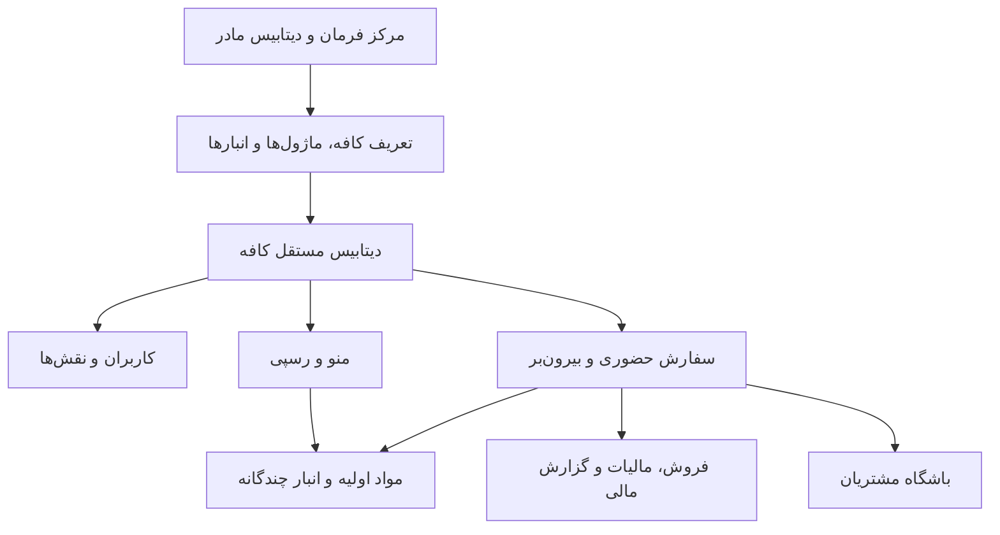

# گزارش تست مسیر کامل کافه

تاریخ اجرا: ۱۴۰۵/۰۵/۲۲ (2026-08-13)

## سناریوی اجراشده از رابط کاربری

1. ساخت «کافه مسیر کامل» با شناسه `full-journey`، همه هفت ماژول و سه انبار.
2. ورود مستقیم مدیر مرکزی بدون رمز جداگانه و بازگشت امن به مرکز فرمان.
3. ورود مستقل مدیر کافه از صفحه عمومی، بدون عبور از مرکز فرمان.
4. ثبت مواد اولیه قهوه، شیر و شکر؛ ثبت سه خرید و سه تأمین‌کننده.
5. انتقال موجودی از انبار مرکزی به آشپزخانه و بار و کنترل موجودی هر انبار.
6. ساخت دسته «نوشیدنی‌های گرم»، آیتم «لاته مسیر کامل» و رسپی ۱۸ گرم قهوه + ۲۲۰ میلی‌لیتر شیر.
7. ثبت و تسویه دو سفارش بیرون‌بر، کنترل مصرف مواد، مشتری، مالیات و گزارش مالی.
8. ثبت درخواست صندوق‌دار از پنل کافه، تأیید آن در مرکز فرمان و ورود با نقش محدود.

## داده‌های نهایی قابل بررسی

- فروش ثبت‌شده: 403,300
- مالیات ثبت‌شده: 33,300 (۹ درصد)
- سفارش پرداخت‌شده: ۲
- انبار مرکزی پس از دو فروش: قهوه 3464 گرم، شیر 6560 میلی‌لیتر، شکر 3000 گرم
- انبار آشپزخانه: شیر 5000 میلی‌لیتر و شکر 1000 گرم
- انبار بار و سرویس: قهوه 1500 گرم

## نقشه سرویس

## باگ‌های کشف و اصلاح‌شده

- موجودی صفر آیتم رسپی‌دار: اکنون ظرفیت قابل‌تولید از کم‌موجودترین ماده محاسبه می‌شود.
- اختلاف مالیات ۱۲٪ رابط با ۹٪ سرور: هر دو از تنظیمات همان کافه می‌خوانند.
- حذف نام مشتری هنگام تسویه مستقیم: تسویه ابتدا اطلاعات مشتری و تخفیف را ذخیره می‌کند.
- مسیر نامعتبر `/admin/menu`: به مسیر اصلی مدیریت منو هدایت می‌شود.
- ورود کاربران از صفحه مدیر مرکزی: لندینگ و مسیر مستقل `/login` ایجاد شد.
- نمایش لینک‌های غیرمجاز برای نقش‌ها: ناوبری با نقش صندوق‌دار/انباردار/حسابدار/مدیر هماهنگ شد.
- نمایش `None` در فیلدهای خالی و گزارش‌ها: به مقدار خالی یا خط تیره تبدیل شد.
- لینک قدیمی داشبورد در کاربران و تنظیمات: به `/dashboard/` یکپارچه شد.
- نبود انتخاب همه ماژول‌ها در ساخت کافه: کنترل انتخاب/لغو همه اضافه شد.
- شکست capture آزمون‌ها روی ویندوز: پیکربندی UTF-8 بدون تعویض stream اصلاح شد.

## اعتبارسنجی

- ۱۲ تست خودکار معماری، جداسازی مستأجرها، SSO، ماژول‌ها و نقش‌ها: موفق.
- تست تعاملی مرورگر برای لندینگ، ورود مستقل، خرید، انبار، رسپی، سفارش، مشتری، گزارش مالی و نقش صندوق‌دار: موفق.

## گیت‌هاب

ریموت فعلی `salehmohamadkhani/cafe` و حساب فعال `salehmohamadkhani` است. در این مرحله هیچ Push انجام نشده است.
